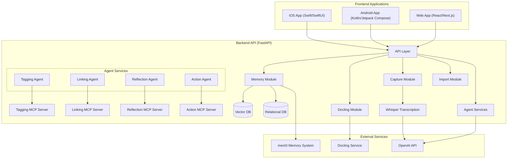

```mermaid
graph TD
    subgraph "Frontend Applications"
        iOS["iOS App (Swift/SwiftUI)"]
        Android["Android App (Kotlin/Jetpack Compose)"]
        Web["Web App (React/Next.js)"]
    end

    subgraph "Backend API (FastAPI)"
        API["API Layer"]
        API --> Memory["Memory Module"]
        API --> Docling["Docling Module"]
        API --> Capture["Capture Module"]
        API --> Import["Import Module"]
        API --> Agents["Agent Services"]
        
        Memory --> MemDB[(Vector DB)]
        Memory --> RelDB[(Relational DB)]
        
        subgraph "Agent Services"
            TaggingAgent["Tagging Agent"]
            LinkingAgent["Linking Agent"]
            ReflectionAgent["Reflection Agent"]
            ActionAgent["Action Agent"]
        end
        
        TaggingAgent --> TaggingMCP["Tagging MCP Server"]
        LinkingAgent --> LinkingMCP["Linking MCP Server"]
        ReflectionAgent --> ReflectionMCP["Reflection MCP Server"]
        ActionAgent --> ActionMCP["Action MCP Server"]
        
        Capture --> Whisper["Whisper Transcription"]
    end
    
    iOS --> API
    Android --> API
    Web --> API
    
    subgraph "External Services"
        OpenAI["OpenAI API"]
        Mem0["mem0 Memory System"]
        DoclingService["Docling Service"]
    end
    
    Memory --> Mem0
    Docling --> DoclingService
    Agents --> OpenAI
    Whisper --> OpenAI
```
