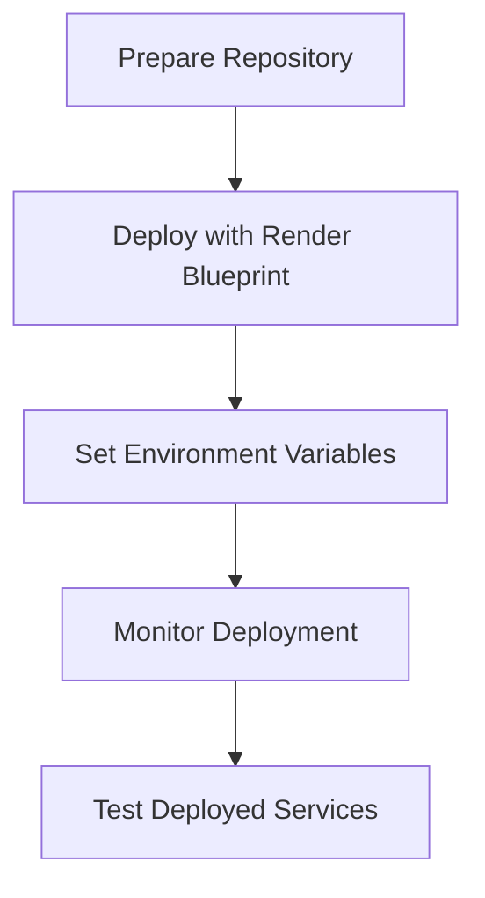
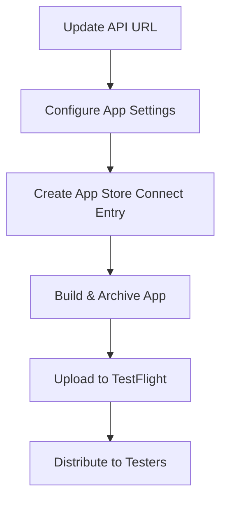

# Deployment Plan for Mirza Mirror

This document outlines the complete process for deploying the Mirza Mirror thought externalization system on Render and preparing the iOS application for TestFlight testing.

## Phase 1: Deploying on Render



### Step 1: Prepare Repository
1. Fork/clone the repository to your GitHub account
2. Ensure the repository is public or connected to Render

### Step 2: Deploy using Render Blueprint
1. Log in to Render account
2. Click "New" and select "Blueprint"
3. Connect to the GitHub repository
4. Render will detect the render.yaml file
5. Review services to be created (API, web app, database)
6. Click "Apply" to start deployment

### Step 3: Set Environment Variables
1. Set OPENAI_API_KEY for the API service
2. Ensure DATABASE_URL is correctly configured
3. Set other required variables not in render.yaml

### Step 4: Monitor and Test
1. Track deployment progress in Render dashboard
2. Check logs for errors
3. Verify services are running: 
   - API: https://mirza-mirror-api.onrender.com
   - Web: https://mirza-mirror-web.onrender.com

## Phase 2: Preparing iOS App for TestFlight



### Step 1: Update API Configuration
1. Open iOS project in Xcode
2. Modify APIService.swift to use production URL:
   ```swift
   private let baseURL = "https://mirza-mirror-api.onrender.com"
   ```

### Step 2: Configure App Settings
1. Set Bundle Identifier
2. Configure version/build numbers
3. Set up signing certificates
4. Review app capabilities

### Step 3: Build and Submit
1. Archive app in Xcode (Product > Archive)
2. Validate the archive
3. Upload to App Store Connect
4. Wait for processing

### Step 4: TestFlight Setup
1. Create TestFlight group
2. Add test users
3. Enable testing for the build
4. Send invitations

## Troubleshooting

### Render Deployment Issues
- If database connections fail, check the connection string in environment variables
- For API service failures, verify that all required environment variables are set
- If the web app can't connect to the API, ensure CORS settings are correctly configured

### TestFlight Issues
- Code signing problems: Verify certificates and provisioning profiles
- Missing entitlements: Ensure all required app capabilities are enabled
- Build rejection: Review common reasons for TestFlight rejection and address accordingly

## Monitoring and Maintenance
1. Set up monitoring in Render dashboard
2. Review TestFlight crash reports and user feedback
3. Implement fixes and improvements based on testing results